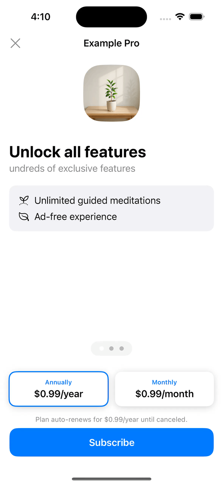

# MarketingContent

A SwiftUI library for creating beautiful marketing content pages for your iOS app subscriptions and premium features.

## Overview

MarketingContent is a Swift Package that provides a set of UI components to present your app's features, reviews, and FAQs in an elegant and engaging way. It's specifically designed to complement subscription offerings and showcase the value of your premium features.



## Features

- **Tab-based Content Display**: Organizes your marketing content in an intuitive tabbed interface
  - Features showcase
  - User reviews
  - Frequently asked questions

- **Flexible Entity Model**: Easy-to-implement protocols for your content
  - Feature
  - Award
  - Review
  - FAQ

- **Modern SwiftUI Design**: Built with SwiftUI for a beautiful, native iOS experience

- **StoreKit Integration**: Designed to work perfectly with SubscriptionStoreView

## Requirements

- iOS 17.0+
- Swift 6.1+

## Installation

### Swift Package Manager

Add MarketingContent to your project through Swift Package Manager:

```swift
dependencies: [
    .package(url: "https://github.com/noppefoxwolf/MarketingContent.git", from: "1.0.0")
]
```

## Usage

### Basic Implementation

```swift
import SwiftUI
import MarketingContent
import StoreKit

struct ContentView: View {
    var body: some View {
        NavigationView {
            SubscriptionStoreView(
                productIDs: [
                    "your.product.id.monthly",
                    "your.product.id.annually"
                ],
                marketingContent: {
                    MarketingContentView(marketingContent: createContent())
                }
            )
            .subscriptionStoreControlStyle(.compactPicker)
        }
    }
    
    func createContent() -> MarketingContent {
        MarketingContent(
            title: Text("Your App Pro"),
            image: Image("app-icon"),
            headlineText: Text("Unlock Premium Features"),
            subheadlineText: Text("Enhance your experience with exclusive content"),
            features: [
                // Your features
            ],
            awards: [
                // Your awards
            ],
            reviews: [
                // Your reviews
            ],
            faqs: [
                // Your FAQs
            ]
        )
    }
}
```

### Implementing the Protocols

Create your own conforming types:

```swift
struct AppFeature: Feature {
    var id: UUID = UUID()
    var title: Text
    var image: Image
}

struct AppAward: Award {
    var id: UUID = UUID()
    var title: Text
}

struct AppReview: Review {
    var id: UUID = UUID()
    var rate: Double
    var title: Text
    var reviewer: Text
    var message: Text?
    var image: Image?
}

struct AppFAQ: FAQ {
    var id: UUID = UUID()
    var question: Text
    var answer: Text
}
```

## Example

Check the included Example project to see MarketingContent in action.

## License

MarketingContent is available under the MIT license. See the [LICENSE](LICENSE) file for more info.
